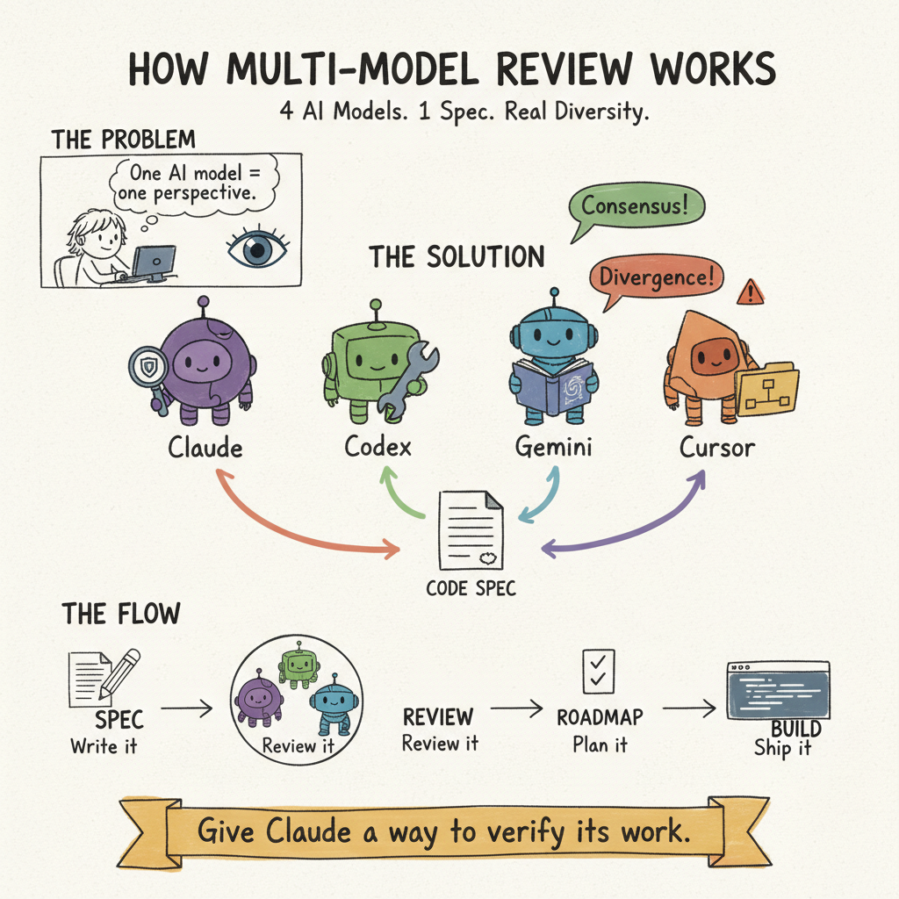

# Claude Code Workflow Skills

A skill system for Claude Code that adds structured planning, real multi-model spec review, and session management. Four AI models review your specs in parallel — not simulated personas, but actual CLI calls to Codex, Gemini, and Cursor alongside Claude.

> "Give Claude a way to verify its work." — Boris Cherny



This is the **public, shareable** skill system. It installs into your existing Claude Code setup alongside any personal configuration you already have.

---

## About

Most AI coding workflows rely on a single model's perspective. This project brings genuine multi-model review to Claude Code — each model runs independently through its own CLI, then results are consolidated with consensus and divergence tagging. Combined with structured planning and session management, it turns Claude Code into a repeatable engineering workflow.

---

## Features

- **Multi-model spec review** — Parallel review from Claude, Codex (OpenAI), Gemini (Google), and Cursor (Anysphere)
- **Consensus tagging** — Items flagged by 2+ models get highlighted; divergences are called out
- **Planning wizard** — Spec interview, review, scoping, and execution setup in one flow
- **Session management** — Start/end sessions with context preservation and automatic commits
- **Knowledge capture** — Document solutions for future lookup (first debug 30 min, future lookups seconds)
- **Graceful fallback** — Works with Claude alone if external CLIs aren't installed

---

## Getting Started

### Plugin (Recommended)

From any Claude Code session:

```
/plugin marketplace add matthewod11-stack/claude-setup
```

This installs the skills as a plugin — no manual file copying needed.

### Legacy (install.sh)

```bash
git clone https://github.com/matthewod11-stack/claude-setup.git
cd claude-setup
./install.sh
```

Restart Claude Code after installing. The installer copies skills, reference docs, scripts, and templates into `~/.claude/` — it won't overwrite existing files in your solutions library.

### Optional: External CLIs

For real multi-model reviews, install the external CLIs:

```bash
npm install -g @openai/codex @google/gemini-cli
# Plus: cursor-agent from cursor.sh
```

See [Multi-Model Setup](docs/MULTI-MODEL-SETUP.md) for details.

---

## Skills

7 skills available via `/command` in Claude Code:

| Command | Purpose |
|---|---|
| `/plan-master` | Master planning wizard with checkpoints |
| `/spec-review-multi` | Real multi-model parallel spec review |
| `/roadmap-with-validation` | Scoping + validation |
| `/session-start` | Begin work session |
| `/session-end` | End with commit + capture |
| `/checkpoint` | Mid-session save |
| `/compound` | Capture learnings |

Each skill is defined in `skills/<name>/SKILL.md` with YAML frontmatter specifying metadata and tool permissions.

---

## Multi-Model Review

The `/spec-review-multi` skill launches real external AI CLIs for genuine review diversity:

| Model | Provider | Focus |
|---|---|---|
| Claude | Anthropic | Edge cases, security, architecture |
| Codex | OpenAI | Feasibility, API design, DX |
| Gemini | Google | Patterns, breadth, documentation |
| Cursor | Anysphere | File structure, modules, navigation |

Without CLIs installed, it falls back to Claude-only review. With CLIs installed, you get four genuinely different AI perspectives, consolidated with consensus and divergence tagging.

---

## Tech Stack

| Technology | Role |
|---|---|
| Shell (Bash) | Multi-model orchestrator and CLI wrappers |
| Claude Code Skills | Slash commands and workflow definitions |
| Codex CLI | OpenAI review agent |
| Gemini CLI | Google review agent |
| Cursor Agent | Anysphere review agent |

---

## Workflow

| Tier | Flow | Best For |
|---|---|---|
| Lite | Spec > Roadmap > Build | Side projects |
| Full | Spec > Review > Roadmap > Validate > Build | Production work |

Rule of thumb: could rebuild in a weekend? Lite. Otherwise, Full.

---

## Documentation

- [Philosophy](docs/PHILOSOPHY.md) — Why this approach works
- [Skills Reference](docs/SKILLS.md) — Detailed skill documentation
- [Multi-Model Setup](docs/MULTI-MODEL-SETUP.md) — External CLI installation
- [Reference Protocols](reference/) — Implementation details

---

## Repo Structure

```
claude-setup/
├── .claude-plugin/            # Plugin manifest for marketplace install
│   ├── plugin.json
│   └── marketplace.json
├── skills/                    # Skill definitions (SKILL.md with YAML frontmatter)
│   ├── plan-master/
│   ├── spec-review-multi/
│   ├── session-start/
│   ├── session-end/
│   ├── checkpoint/
│   ├── compound/
│   └── roadmap-with-validation/
├── reference/                 # Protocol documentation (source of truth)
├── scripts/                   # Multi-model orchestrator + CLI wrappers
├── docs/                      # Human-readable guides
├── templates/                 # Starter files for new projects
├── solutions/                 # Solutions library structure
├── install.sh                 # Legacy installer
└── LICENSE
```

---

## Extending This

These skills are designed as a foundation. You can:

- **Edit skills** — Modify `skills/*/SKILL.md` files directly
- **Add your own skills** — Create new `skills/<name>/SKILL.md` directories
- **Build a private config** — Keep a separate `~/.claude/` git repo for personal tools and layer skills on top
- **Fork and customize** — Clone, remove what you don't need, add your own protocols

---

## Credits

- **Boris Cherny** — Claude Code creator, verification philosophy
- **Every.to** — Compound engineering methodology
- **Thariq** — Spec interview pattern

---

## License

[MIT](LICENSE)

---

*Built with Claude Code. Improved through multi-model review.*
